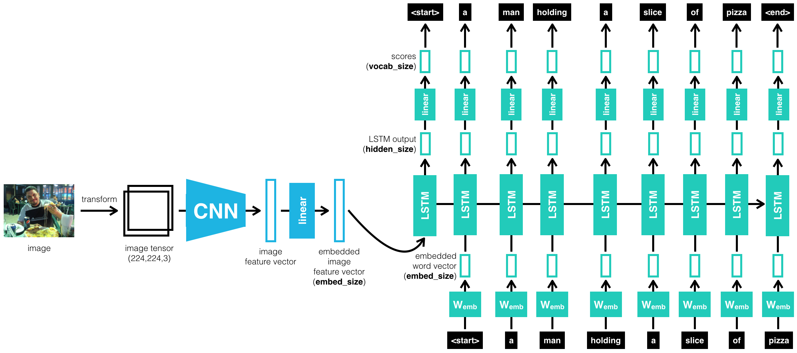

# Image Captioning Project


This project demonstrates the usage of a combined CNN-RNN to generate captions from images. 
It was completed as part of Udacity's Computer Vision Nano-degree and is inspired by
the paper - [Show and Tell : A Neural Image Caption Generator - O.Vinyals et. al](https://arxiv.org/abs/1411.4555v2)  but is not meant at all to reproduce their results. 

Here's a demo of some nicely generated captions on unseen images.


and also a couple examples of bad captions generated by the model.


# Setup & Usage

1. Download the COCO dataset images & captions into a data/ directory 
```bash
./download_data.sh
```

2. Create and configure the Python environment
```bash
conda create -n image_caption 
conda activate image_caption
pip install -r requirements.txt
```
3. Run the Training Notebook : [Training Notebook](1_Train_Model.ipynb)

You could also skip this step and move to inference & use the pre-trained model. 

4. Inference. Evaluate on Test Data : [Inference Notebook](2_Inference.ipynb)


# How & Why it Works 



## Model
The Encoder CNN is a pretrained ResNet50 with fixed ( non-trainable ) parameters. 
The Decoder RNN is composed of X layers of LSTM cells. 


## Training
The dataset is composed of ... etc. & this is how the network is trained. 


## Inference
I used a simple sampling based approach to caption generation. 
In this the RNN is fed in the encoded image after passing through the CNN. 
After that, the words are sampled one after the other through the RNN's generated probability distributions
until the maximum length of X is reached. 


